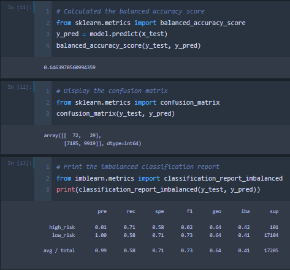
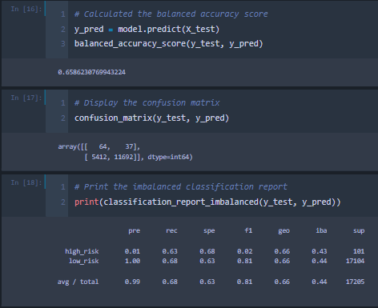
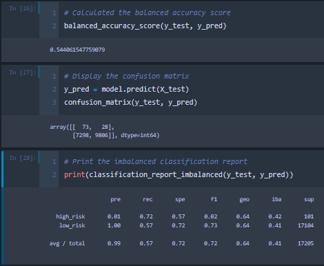
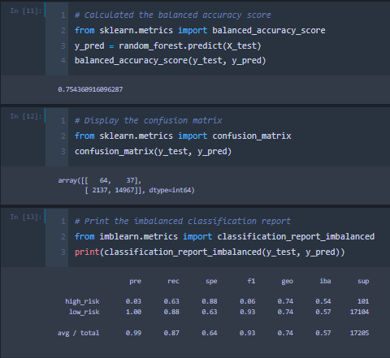
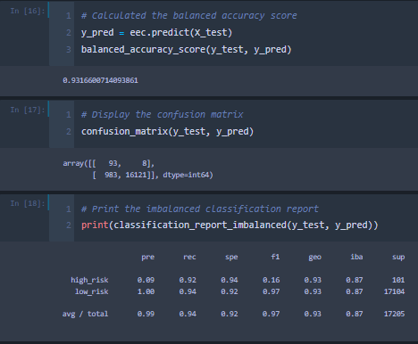

# Credit_Risk_Analysis

## Project Overview

The purpose of this project is to assess the viability of various Supervised Machine Learning models as means of predicting credit risk. The models being reviewed are:

- Resampling Models: 
    - RandomOverSampler 
    - SMOTE
    - ClusterCentroids
- SMOTEEN Algorithm
- Ensemble Classifiers:
    - Balanced Random Forest Classifier
    - Easy Ensemble Classifier

The metrics used for the comparison of these models will be their respective precision, recall, and balanced accuracy scores.

## Results

### RandomOverSampler

- balanced accuracy score: 64.64%
- precision score high risk: 1%
- precision score low risk: 100%
- recall score high risk: 71%
- recall score low risk: 58%

### SMOTE

- balanced accuracy score: 65.86%
- precision score high risk: 1%
- precision score low risk: 100%
- recall score high risk: 63%
- recall score low risk: 68%

### ClusterCentroids

- balanced accuracy score: 54.41%
- precision score high risk: 1%
- precision score low risk: 100%
- recall score high risk: 69%
- recall score low risk: 40%

### SMOTEEN Algorithm

- balanced accuracy score: 54.41%
- precision score high risk: 1%
- precision score low risk: 100%
- recall score high risk: 72%
- recall score low risk: 57%

### Balanced Random Forest Classifier

- balanced accuracy score: 75.44%
- precision score high risk: 3%
- precision score low risk: 100%
- recall score high risk: 63%
- recall score low risk: 88%

### Easy Ensemble Classifier 

- balanced accuracy score: 93.17%
- precision score high risk: 9%
- precision score low risk: 100%
- recall score high risk: 92%
- recall score low risk: 94%

## Summary

Of the six models assessed in this project the best was the Easy Ensemble Classifier with a balanced accuracy score of 93.17%, a high credit risk precision score of 9% and a high credit risk recall score of 92%.

Whether or not this model can be recommended for use by the company will depend on how it is intended to be implemented. A high recall score for high credit risk of 92%, means that a high percentage of those who are of high risk will be properly identified. This means the model would be useful for automatically approving those identified with low credit risk, as few people of high credit risk will have slipped through the cracks into the wrong classification. However, the high credit risk precision score is very low at 9%, which means there are a lot of false positives where people with low credit risk are misidentified as having high credit risk. This would then not be recommended for automating the denial of those identified as being high risk since many good applicants would be denied incorrectly. Instead, those identified as high credit risk would need to go be reviewed or go through further analysis before a final denial should take place. 

