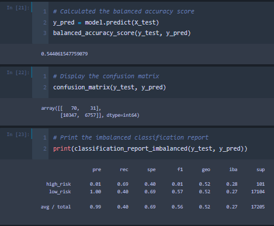

# Credit_Risk_Analysis

## Project Overview

The purpose of this project is to assess the viability of various Supervised Machine Learning models as means of predicting credit risk. The models being reviewed are:

- Resampling Models: 
    - RandomOverSampler 
    - SMOTE
    - ClusterCentroids
- SMOTEEN Algorithm
- Ensemble Classifiers:
    - Balanced Random Forest Classifier
    - Easy Ensemble Classifier

The metrics used for the comparison of these models will be their respective precision, recall, and balanced accurancy scores.

## Results

### RandomOverSampler

- balanced accurancy score: 64.64%
- precision score high risk: 1%
- precision score low risk: 100%
- recall score high risk: 71%
- recall score low risk: 58%

### SMOTE

- balanced accurancy score: 65.86%
- precision score high risk: 1%
- precision score low risk: 100%
- recall score high risk: 63%
- recall score low risk: 68%

### ClusterCentroids

- balanced accurancy score: 54.41%
- precision score high risk: 1%
- precision score low risk: 100%
- recall score high risk: 69%
- recall score low risk: 40%

### SMOTEEN Algorithm

- balanced accurancy score: 54.41%
- precision score high risk: 1%
- precision score low risk: 100%
- recall score high risk: 72%
- recall score low risk: 57%

### Balanced Random Forest Classifier

- balanced accurancy score: 75.44%
- precision score high risk: 3%
- precision score low risk: 100%
- recall score high risk: 63%
- recall score low risk: 88%

### Easy Ensemble Classifier 

- balanced accurancy score: 93.17%
- precision score high risk: 9%
- precision score low risk: 100%
- recall score high risk: 92%
- recall score low risk: 94%

## Summary
